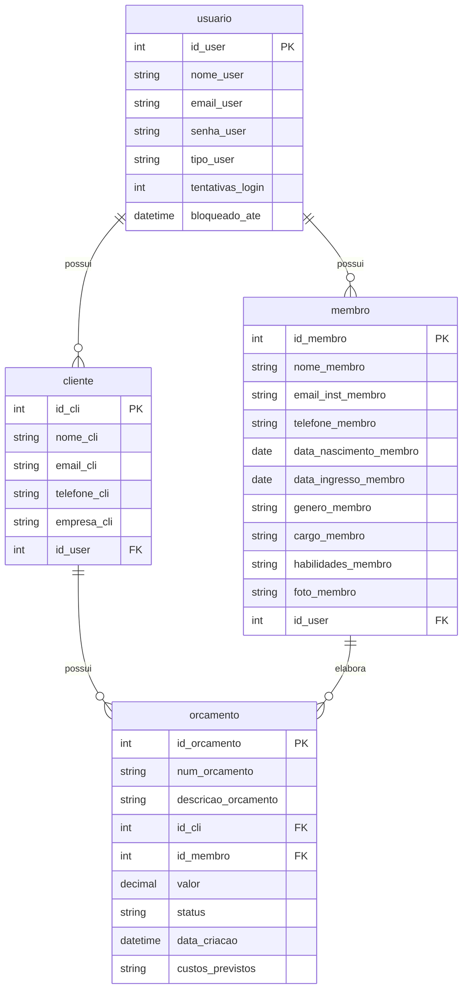

# API-RHAEGAL

## Índice

* [Descrição do Projeto](#descrição)
* [Tecnologias Utilizadas](#tecnologias-utilizadas-)
* [Modelagem de Dados](#modelagem-de-dados)
* [Arquitetura e Organização de Código](#arquitetura-e-organização-do-código)
* [Instalação e Configuração](#instalação-e-configuração)
* [Uso](#uso)
* [Testes](#testes)
* [Licença](#licença)
* [Autores](#autores)
* [Contato](#contato)

## Descrição

Este projeto foi desenvolvido como parte do Desafio de Backend da Comp Júnior 2025.1. A API Rhaegal permite o gerenciamento de membros, orçamentos e clientes, com funcionalidades completas de autenticação JWT, envio de e-mail via Mailtrap e bloqueio automático após múltiplas tentativas de login.

## Tecnologias Utilizadas 🚀

* **MySql**: Banco de dados relacional utilizado no armazenamento das entidades.
* **NodeJS**: Ambiente de execução JavaScript no back-end.
* **Express**: Framework minimalista para construção de APIs RESTful.
* **bcryptjs**: Biblioteca para hashing de senhas, usada na segurança de login.
* **jsonwebtoken (JWT)**: Para autenticação via tokens.
* **nodemailer**: Usado para envio de e-mails com códigos de recuperação.
* **dotenv**: Permite trabalhar com variáveis de ambiente.

## Modelagem de Dados

### Entidades principais
* **Usuário** (`usuario`): id_user, nome_user, email_user, senha_user, tipo_user, tentativas_login, bloqueado_ate  
* **Membro** (`membro`): id_membro, nome_membro, email_inst_membro, telefone_membro, data_nascimento_membro, data_ingresso_membro, genero_membro, cargo_membro, habilidades_membro, foto_membro  
* **Cliente** (`cliente`): id_cli, nome_cli, email_cli, telefone_cli, empresa_cli  
* **Orçamento** (`orcamento`): id_orcamento, num_orcamento, descricao_orcamento, id_cli, id_membro, valor, status, data_criacao, custos_previstos  

### Diagrama de Entidades



## Arquitetura e Organização de Código

A aplicação adota uma arquitetura em camadas dividida entre:

* **DAO (Data Access Object)**: Manipula diretamente o banco com SQL.
* **Controllers**: Camada lógica para tratar requisições HTTP.
* **Middlewares**: Autenticação e autorização por tipo de usuário.
* **Models**: Representações das entidades.
* **Routes**: Define os endpoints.
* **Config**: Conexão com banco e serviço de e-mail.

As rotas estão organizadas por entidade dentro de `src/routes` e os controllers em `src/controllers`.

## Instalação e Configuração

### Pré-requisitos

* Node.js v20 ou superior
* MySQL
* Postman para testes

### Passos para instalação

1. Clone o repositório:

```bash
git clone https://github.com/seu-usuario/rhaegal.git
```

2. Instale as dependências:

```bash
cd rhaegal
npm install
```

3. Crie o arquivo `.env` na raiz do projeto com base nas variáveis:

```env
DB_HOST=localhost
DB_USER=root
DB_PASSWORD=suasenha
DB_NAME=rhaegon_db
PORT=3000

MAILTRAP_HOST=smtp.mailtrap.io
MAILTRAP_PORT=587
MAILTRAP_USER=usuario_mailtrap
MAILTRAP_PASS=senha_mailtrap
JWT_SECRET=sua_chave_super_secreta
```

4. Execute o script SQL de criação das tabelas (se necessário) e certifique-se de que o banco está acessível.

5. Inicie o servidor:

```bash
node server.js
```

A API estará disponível em: `http://localhost:3000`

## Uso

### Endpoints principais

#### Usuário

* `POST /usuario/cadastrar` — Criação de usuário (admin ou cliente)
* `POST /usuario/login` — Login com JWT e controle de tentativas
* `POST /usuario/esqueci` — Envio de código de recuperação por e-mail
* `POST /usuario/redefinir` — Redefinir senha com código
* `GET /usuario` — Listagem de usuários (admin)

#### Membro

* `POST /membro/cadastrar` — Cadastro de membro
* `GET /membro` — Listagem de membros
* `GET /membro?nome=...` — Filtro por nome
* `PUT /membro/:id` — Atualização
* `DELETE /membro/:id` — Exclusão

#### Cliente

* `POST /cliente/cadastrar` — Cadastro de cliente
* `GET /cliente` — Listagem
* `PUT /cliente/:id` — Atualização
* `DELETE /cliente/:id` — Exclusão

#### Orçamento

* `POST /orcamento/cadastrar` — Criação de orçamento
* `GET /orcamento` — Listagem com filtros (`status`, `id_cli`)
* `PUT /orcamento/:id` — Atualização de orçamento
* `DELETE /orcamento/:id` — Exclusão

> Todas as rotas protegidas requerem autenticação via token JWT.

## Testes

Os testes do projeto foram realizados manualmente utilizando o Postman. Foram testados os seguintes fluxos:

* Cadastro e login de usuários
* Controle de tentativas com bloqueio após 3 falhas
* Recuperação e redefinição de senha via e-mail
* Cadastro, listagem, edição e exclusão de membros, clientes e orçamentos

> 🚧 Em versões futuras, pretende-se adicionar testes automatizados utilizando Jest ou Supertest.

## Licença:

Este projeto foi desenvolvido exclusivamente para fins educacionais no contexto do Desafio de Backend da Comp Júnior 2025.1. &#x20;

Não possui finalidade comercial nem está aberto para redistribuição formal.

## Autores

* **Marcos Vinícius Pereira – Desenvolvedor responsável pelo backend da aplicação Rhaegal.**

## Contato

Para mais informações ou[ ](https://github.com/mvk999)dúvidas entre em contato:

## Contato  
- GitHub: [https://github.com/mvk999](https://github.com/mvk999)  
- LinkedIn: [https://www.linkedin.com/in/mvpereira2006](https://www.linkedin.com/in/mvpereira2006)
